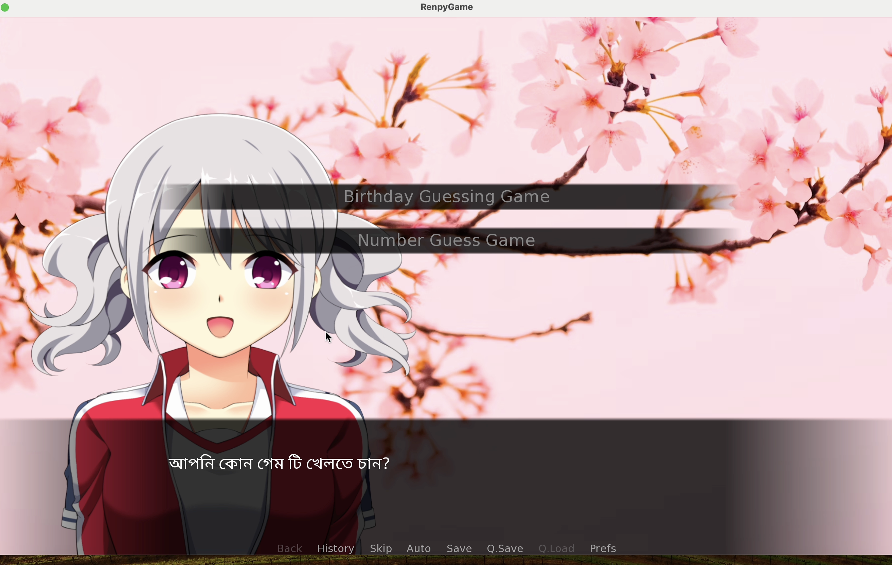

# Birthday & Number Guessing Game

This project is an interactive visual novel game built using the Ren'Py engine. It includes two fun mini-games where users can either guess their birthday through a sequence of calculations or play a number guessing game. The game features interactive dialogue in Bengali and has user-friendly visuals for an engaging experience.



## Table of Contents
- [Features](#features)
- [Game Description](#game-description)
- [Setup and Installation](#setup-and-installation)
- [How to Play](#how-to-play)
  - [Birthday Guessing Game](#birthday-guessing-game)
  - [Number Guessing Game](#number-guessing-game)
- [Contributing](#contributing)
- [License](#license)

## Features
- **Bengali Language Support:** All dialogues and interactions are in Bengali.
- **Birthday Guessing Game:** Charu, the main character, walks you through a fun math game to guess your birthday.
- **Number Guessing Game:** Test your guessing skills as you try to guess a number within a limited range.
- **Customizable Player Name:** Players can enter their name for personalized interactions.
- **Dynamic Visuals:** The characters and background change based on the game’s progress, providing a visually immersive experience.

## Game Description

### Birthday Guessing Game
In this game, Charu will guide the player through a series of mathematical steps, ultimately revealing the player’s birthday. The steps are fun and challenging, and the result is presented in a friendly and engaging way.

### Number Guessing Game
This classic number guessing game challenges the player to guess a random number. Players are given clues whether the number is higher or lower until they find the correct number.

## Setup and Installation

### Prerequisites
- **Ren'Py SDK:** You must have Ren'Py installed to run the game. You can download Ren'Py from [here](https://www.renpy.org/).
- **Python (Optional):** If you're making changes or want to run the game outside of the Ren'Py engine.

### Installation Steps
1. **Download Ren'Py SDK**: Download and install the Ren'Py SDK from the official site.
2. **Clone or Download the Repository**:
   - Clone the repository using Git:
     ```bash
     git clone https://github.com/K-Ashik/Renpy-Number-and-Birthday-Guessing-Game.git
     ```
   - Or download the project as a ZIP file and extract it.
3. **Open the Project in Ren'Py**:
   - Launch the Ren'Py SDK.
   - Click on "Select Project" and navigate to the folder where you cloned or downloaded this project.
   - Select the project folder.

4. **Run the Game**:
   - Once the project is selected, click the "Launch Project" button in the Ren'Py interface to start the game.

## How to Play

When you start the game, you will be prompted to choose between two games:

1. **Birthday Guessing Game**:
   - The character Charu will ask you to input some information and follow some mathematical steps.
   - Follow Charu's instructions, and at the end of the process, your birthday will be revealed!

2. **Number Guessing Game**:
   - You will have to guess a number chosen by the system within a specified range.
   - After each guess, you will receive feedback indicating whether the guess was too high or too low.

### Controls:
- Use the mouse or keyboard to make choices during the dialogue prompts.
- Follow the on-screen instructions to play each game.

## Contributing
Contributions are welcome! If you find bugs, feel free to open an issue or submit a pull request.

To contribute:
1. Fork the project.
2. Create a new branch (`git checkout -b feature-branch`).
3. Commit your changes (`git commit -m 'Add some feature'`).
4. Push to the branch (`git push origin feature-branch`).
5. Open a Pull Request.

## License
This project is licensed under the MIT License. See the LICENSE file for more details.

---

### Notes:
- Replace `K-Ashik` with your actual GitHub username in the Git URL if you plan to host the project on GitHub.
- Add any additional sections you think might be relevant for your game!
